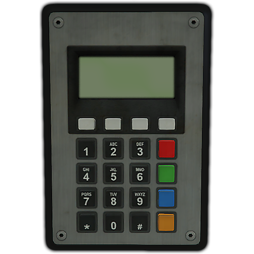
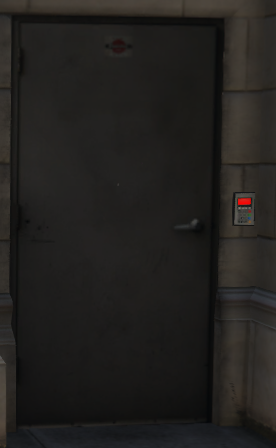
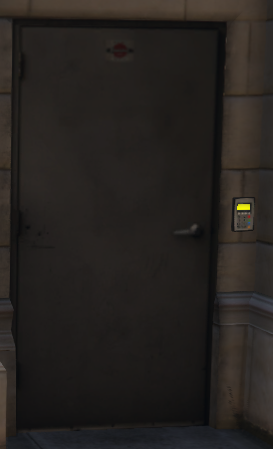
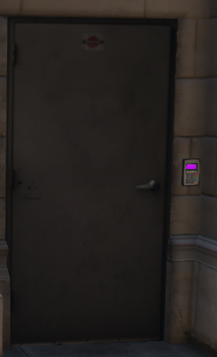

# Demmy's Locking Resource #

`demmylock` is a door locking resource for [FiveM](https://fivem.net/), and is entirely useless without a `cfx-server` running and a FiveM client connected to that server.

## Assumptions

This documentation *assumes* you know the basics of editing `.lua` and `.json` files. The syntax of such files is not explained here, but you might be able to guess what to do based on the examples. Your server will not explode from you experimenting a little, but you do run the risk of *breaking the locks*, meaning all locked doors *stay frozen in place* and all unlocked doors *are open to everyone*. It is highly recommended to play around with this on your test server before actually using it in production.

## Support

Absolutely no support what so ever is given for this resource. If you have an issue with it you are invited to create an issue here on GitHub, but there are absolutely no guarantees that I will do anything about it. "How do I..." issues may be closed without comment.

Feel free to submit pull requests (including against the documentation!) if you have anything to contrubute. Feature requests without provided use cases and/or code will be ignored, though.

## Why create DemmyLock?

`demmylock` was created from an idea that all the different door lock scripts are all very dependant on their frameworks, and are generally very aesthetically displeasing.
What I set out to do here, was to make it ever so slightly prettier, by not depending on floating 3D text, and to make it completely independant from any framework.

In `demmylock` it doesn't matter what "job" you have. This script has no idea.  
It cares about one thing, and one thing only: _Do you know the code?_

To visualize the lock, two components are used.
1. The prop `prop_ld_keypad_01` 
2. A tiny marker number 42 (the square one)

The marker is overlayed over the prop to show the *state* of the lock. More on that in the [Lock states](#lock-states) section. When you approach the lock, you get a so-called helptext in the upper left corner, and if you press the right button you will be shown a keypad. The keypad graphics are based on a screenshot of the prop used.

Also, performance. After a bit of tinkering I'm confident that `demmylock` outperforms all other publically released general-purpose door locking resource. If it doesn't, please point this out to me, and I'll head over to it to get schooled.

## What do the buttons do?



The numbers, as well as `*` and `#`, can be entered as part of the code.  

| Button       | What it does                               |
|--------------|--------------------------------------------|
| 0-9, # and * | Enter as part of the code                  |
| Red          | Use the entered code to *lock* the door    |
| Green        | Use the entered code to *unlock* the door  |
| Blue         | Erase the last digit entered               |
| Yellow       | Clear keypad entry entirely                |
| Silver       | Does exactly nothing                       |

## Reusing codes ##

When a code is entered, it is stored on the client as the code for that door. That means you don't have to enter the code again the next time you use that door, and a different prompt is shown for the helptext. This is useful for everyone, but especially for streamers. It means you only have to hide the code *the first time you enter it*, and then you can re-use that code for as long as it's valid.

If the server responds with "Na-ah, that's the wrong code!", that code is forgotten for ever, and you will have to enter a new code the next time you want to open that lock.

## Lock states ##

The locks have four *states*. These are:

| Color  | State       | Meaning                  |
|--------|-------------|--------------------------|
| Red    | Locked      | Nobody can walk through. |
| Green  | Unlocked    | Open for anyone. |
| Yellow | Will relock | Open for anyone, but will lock automatically soon. |
| Purple | Teleport    | Anyone can step through, but only for a few seconds. |

The lock states look like this:






## Configuration

In [the configuration file](config.lua), you can mess around with a few settings.

| Setting          | What it changes                          |
|------------------|------------------------------------------|
| keypad           | What prop is used for the keypad object. |
| indicator        | What marker is used to show the state of the lock. |
| teleportTime     | How many *milliseconds* a door stays open for teleportation. |
| doorSpeed        | How quickly a propped-open door swings closed when it is locked. |
| fadeTime         | The number of *milliseconds* it takes for the screen to fade in or out when teleporting. |
| range.areaMargin | How far outside a grouping of locks you can be before they pop up. |
| range.interact   | How far you can be from a keypad and still interact with it. |

## Defining locks

The actual lock definition is really fiddly. I mean, surprisingly fiddly and complicated.  
I highly recommend using some kind of tool to aid you in this. Personally, I make my own tools, so for this I use [DemmyCam](https://github.com/DemmyDemon/demmycam) to do this. I've built "modes" into it that greatly simplifies this work.

Lock definition is done in [locks.lua](locks.lua)

### Overall structure

```lua
LOCKS = {
    ['Area name'] = {
        ['Lock name'] = {
            -- Lock specification goes here
        },
    },
}
```
The area name is never shown to the user, but it's very important when looking up if the code is correct! More on the codes in the [Defining codes](#defining-codes) section.


### Simple locks

A simple lock is a lock that has a keypad on the wall and a single regular swinging door.

```lua
LOCKS = {
    ['Example'] = {
        ['Simple lock'] = {
            locked = true,
            doors = {
                {model=854291622,coords=vector3(346.774, -584.002, 43.434)},
            },
            keypads = {
                {coords=vector3(348.214, -584.642, 43.650),rot=vector3(0.000, -0.000, -20.000)},
            },
        },
    },
}
```

The `locked` bit is simply the state you want the lock to be in when the resource starts.  
High security stuff (jail cells, for example), gets a `true` here, while stuff you might want to lock sometimes gets a `false`. You can also omit this entirely, and `false` will be assumed.

The `doors` bit is a list of doors. A door has three properties.
| Propery | Type    | What it means                             |
|---------|---------|-------------------------------------------|
| model   | Integer | The *hash* of the model name of the door. |
| coords  | vector3 | The coordinates of the door. |
| heading | Float   | No longer used! Gone! |

Using this information, `demmylock` can determine exactly what door you mean, and freeze it when it's locked. Note that it's possible to specify several doors per lock, meaning you operate both doors in a double-door together, if you want.

While `demmylock` makes no effort to stop you from putting the same door under multiple locks, it is not recommended that you do so. It can lead to undesired effects unless you do it very carefully.

The `keypads` bit is telling `demmylock` where you want the keypads that lock and unlock this lock. The example shows a `static keypad`, which means it doesn't move at all. Static keypads have *two* properties.
| Property | Type    | What it means                           |
|----------|---------|-----------------------------------------|
| coords   | vector3 | The exact location to place the keypad. |
| rot      | vector3 | The exact rotation you want the keypad to have, **in rotation order 2**. |

`demmylock` will figure out where to put the state indicator on it's own, based on this information. Note that as with doors, you can place multiple keypads. Typically you want one on each side of the door, but if you want 73 keypads, `demmylock` will let you squander all the resources you want.

### Keypads on the actual doors

A slightly more complicated concept is to place the keypad on the door itself rather than have it stuck to the wall next to it. This looks kinda nice, and is very handy for situations where the walls are difficult to attach to, such as the cell walls in the Mission row lockup.

These keypads move with the door, so I call them `dynamic keypads`.

Again, I want to stress that this is very fiddly to do manually, and you probably want [DemmyCam](https://github.com/DemmyDemon/demmycam) to help you out. Seriously, this is fiddly enough to manually adjust after placing *with* `demmycam`, so doing it without is just going to frustrate you.

```lua
LOCKS = {
    ['Example'] = {
        ['Keypad-on-door lock'] = {
            locked = true,
            doors = {
                {model=854291622,coords=vector3(346.774, -584.002, 43.434),heading=340.204},
            },
            keypads = {
                {door=1,offset=vector3(-1.172, -0.042, -0.127),rot=vector3(0,0,0)},
            },
        },
    },
}
```
Here we use the exact same `doors` section, so see above for that part. What has changed is how `keypads` is defined.
| Property | Type    | What it means |
|----------|---------|---------------|
| door     | Integer | This is a reference to a door. In this case, the first door in the `doors` section. This specifies which door to attach the keypad to. If you have multiple doors, you can attach to whichever one you want. |
| offset   | vector3 | The offset, relative to the center of the door model (including the invisible parts), at which the keypad is attached. |
| rot      | vector3 | The rotation, **in rotation order 2**, that is applied to the keypad, relative to the door it's attached to. |

In this example, there is only one keypad, but typically you want one on either side of the door. While you can *probably* interact with a single keypad from both sides of the door, you lose the nice indicator if you have just the one. Note that it is not a problem at all to combine `static` and `dynamic` keypads for the same lock.

### Automatic relocking

Sometimes it's so important that a door is locked that you don't want to risk forgetting to lock it. That's why *automatic relocking* is supported. Simply add a `relock = 5000` to the lock specification, and it will lock again after 5000 *milliseconds*.

```lua
LOCKS = {
    ['Example'] = {
        ['Simple lock'] = {
            locked = true,
            relock = 5000,
            doors = {
                {model=854291622,coords=vector3(346.774, -584.002, 43.434),heading=340.204},
            },
            keypads = {
                {coords=vector3(348.214, -584.642, 43.650),rot=vector3(0.000, -0.000, -20.000)},
            },
        },
    },
}
```
Of course, that number can be anything you want. It is not possible to lock the door prematurely, so very long relock times are not recommended.

### Propped open

Sometimes it's not enough to just have the door be unlocked. You want it to be actually propped open! To do this, simply add the openness ration you want it at. This ranges from `-1.0` to `1.0`, which are completely open in different directions.

```lua
LOCKS = {
    ['Example'] = {
        ['Simple lock'] = {
            locked = true,
            relock = 5000,
            doors = {
                {model=854291622,coords=vector3(346.774, -584.002, 43.434),open=1.0},
            },
            keypads = {
                {coords=vector3(348.214, -584.642, 43.650),rot=vector3(0.0, 0.0, -20.0)},
            },
        },
    },
}
```

**Note** that almost every time, a double door set will be opposite of eachother if you want them to open the same way. One at `-1.0` and the other at `1.0`.

### Gates

Gates are an outdated concept, and the upsides to this have been baked into normal doors while the upsides to normal doors was preserved. Phew!

### Teleporters

A type of lock that *has no doors at all!* It's just a keypad on a wall, though it's probably best for immersion that it's placed next to what *looks like* a door. There are a million of these around the map. For example, the door I used in my indicator demonstration is not actually a door, it is a wall that is textured to look like a door.

The whole idea behind teleporting locks is to attach a door in one section of the map to a different section. For example, the Maze Bank office tower has a bunch of office locations inside it, but no way to get to them without teleporting.

This is also why it's possible to set a teleporting lock with *multiple destinations!* First, though, let's look at a basic teleporter.

```lua
LOCKS = {
    ['Example'] = {
        ['Server farm'] = {
            locked = true,
            teleport = {
                {
                    coords=vector3(2154.875,2921.012,-81.076),
                    heading=-90.0, 
                    ipl='xm_x17dlc_int_placement_interior_5_x17dlc_int_facility2_milo_',
                },
            },
            keypads = {
                {coords=vector3(107.7, -1090.454, 29.830),rot=vector3(0.008, -0.048, 160.019)},
            },
        },
    },
}
```

**Note:  There is no `doors` section when there is a `teleport` section! The two will conflict.**

Let's have a look at the `teleport` section:

| Property | Type    | What it means |
|----------|---------|---------------|
| coords   | vector3 | The teleport destination in world coordinates. |
| heading  | Float   | The heading you want the player to face when they get to the other side. |
| ipl      | String  | *Optional* interior to load *before* teleporting.

Because teleporters are most often used to go to interior locations, and we don't want users to fall through the void, you can specify an optional interior to load before moving the player.

**Note:** If the specified `ipl` is invalid, it'll be stuck loading for ever, breaking `demmylock` for whomever tries to teleport, so be sure to test this properly!

`demmylock` makes no attempt at loading interior props or setting interior colors or anything of the sort when teleporting. This is not a "MILO manager" resource *at all*, and will only do the most rudementary of checks. If the teleporter leads to somewhere that is loaded automatically, you can just omit the `ipl` here.

After entering the correct code, **anyone** can step through the teleporter by just strolling up to the keypad and pressing *E*. This is intentional, as it enables you to bring people with you through the teleporter *withot telling them the code*, just like when you unlock a regular door.

You can specify *multiple* teleport destinations, and what code is used will determine which is used. You can also use `locked = false` to make a teleporter always be active, but then you will also need to specify what destination to use as it can't use a code to figure that out. Let's use our server room example again, but this time with an always-open exit teleporter.

```lua
LOCKS = {
    ['Example'] = {
        ['Server farm'] = {
            locked = true,
            teleport = {
                {
                    coords=vector3(2154.875,2921.012,-81.076),
                    heading=-90.0,
                    ipl='xm_x17dlc_int_placement_interior_5_x17dlc_int_facility2_milo_',
                },
            },
            keypads = {
                {coords=vector3(107.7, -1090.454, 29.830),rot=vector3(0.008, -0.048, 160.019)},
            },
        },
    },
    ['Inside server farm'] = {
        ['Use elevator'] = {
            locked = false,
            destination = 1,
            teleport = {
                {coords=vector3(109.465, -1090.326, 29.302),heading=20.0},
            },
            keypads = {
                {coords=vector3(2156.355, 2922.228, -80.610),rot=vector3(0.000, 0.000, 31.961)},
            },
        },
    },
}
```

**IMPORTANT NOTE:** It might be tempting to put both the teleporter and the return teleporter in the same `area`. That is to say, put the return teleporter in the `Example` area here. Don't do this. It will create an absurdly large `area` to include both places, and that will cost a lot more resources than is needed to waste. This is absolutely fine for short hops (such as through a door that naturally leads to the other side of the same wall), but for very long teleports this makes the area *very* large, and potentially *always active*.

In this example, we see that the return teleporter, `Use elevator`, is *not* locked, and has `destination = 1`. This means it will use the first teleport destination *every time* and anyone can step through it without ever being asked for a code. Very useful for exits!

Teleporters always close automatically after the time specified in [the configuration](config.lua).

## Defining codes

Code locks are entirely useless if there are no codes. If you don't specify any codes, then any code entered is, by definition, *wrong*. The codes are in a separate file called [codes.json](codes.json). Because the entire [locks.lua](locks.lua) file is transmitted to the client, it's silly to have the codes in there. A techsavvy user would have no trouble at all just opening the resource up and reading the codes. The way this is organized, the `codes.json` file never leaves the server.

### Yeah yeah, whatever, what do I put in the damn code file?

Assuming you have a `locks.lua` that looks like this...

```lua
LOCKS = {
    ['Example'] = {
        ['Simple lock'] = {
            locked = true,
            doors = {
                {model=854291622,coords=vector3(346.774, -584.002, 43.434),heading=340.204},
            },
            keypads = {
                {coords=vector3(348.214, -584.642, 43.650),rot=vector3(0.000, -0.000, -20.000)},
            },
        },
    },
}
```
...you want a `codes.json` that matches, like so...

```json
{
    "Example": {
        "Simple lock": "1234"
    }
}
```

Now anyone can unlock that door by using the code `1234` because `Example` matches the lock's area and `Simple lock` matches the lock's name.

After changing `codes.json`, you don't have to restart the whole resource. You can just issue the command `/reloadlockcodes` to re-read the JSON file.

### Lots of doors with the same code

Imagine you have a building with lots of doors in it, and you want them all to have the same code. Then imagine this code leaks out, and you need to change them all. This is very tedious, which is why there is such a thing as a `_default` code. This code applies to all doors that are *not otherwise specified* in that area, except teleporters.

```json
{
    "Example": {
        "Simple lock": "1234",
        "Another lock": "1234",
        "Yet another lock": "1234",
        "How many locks are there?": "1234",
        "Too damn many" : "1234",
        "This one is special" : "2468"
    }
}
```
...becomes...
```json
{
    "Example": {
        "_default": "1234",
        "This one is special" : "2468"
    }
}
```

### Group codes

When you use the same code for a bunch of doors, the client has no idea. As mentioned, the `codes.json` file is never sent to the client. This means the user has to enter a different code for all the doors, even though the use the same code on the server side.

You can tell the client to re-use any *correct code* for a lock in a group on *other locks in the same group* by specifying that is is a `groupcode` lock.

```lua
LOCKS = {
    ['Example'] = {
        ['This lock'] = {
            locked = true,
            groupcode = true,
            doors = {
                -- You know the drill
            },
            keypads = {
                -- Whatever
            },
        },
        ['That lock'] = {
            locked = true,
            groupcode = true, -- Same code saved
            doors = {
                -- Different doors
            },
            keypads = {
                -- Different keypads
            },
        },
    },
}
```

### Teleporter codes are strange!

Teleporter codes, even when there is just one destination, are different from regular codes.

Let's assume this teleporter exists:
```lua
LOCKS = {
    ['Example'] = {
        ['Server farm'] = {
            locked = true,
            teleport = {
                {coords=vector3(2154.875,2921.012,-81.076),heading=-90.0},
                {coords=vector3(0,0,0),heading=0.0}, -- under the map :O
            },
            keypads = {
                {coords=vector3(107.7, -1090.454, 29.830),rot=vector3(0.008, -0.048, 160.019)},
            },
        },
    },
}
```
...then the code looks like this...
```json
{
    "Example": {
        "Server farm": ["1234", "2468"]
    }
}
```

See those brackets? They indicate that it's a teleporter code. If you walk up to that teleporter and use the code `1234`, which is *the first code*, then you will go to *the first teleporter destination*. If you use the code `2468`, you will go to *the second teleporter destination*.

## Did I miss anything?

Yeah. Interior prop locks are not documented at all, and I probably forgot at least three important points.
